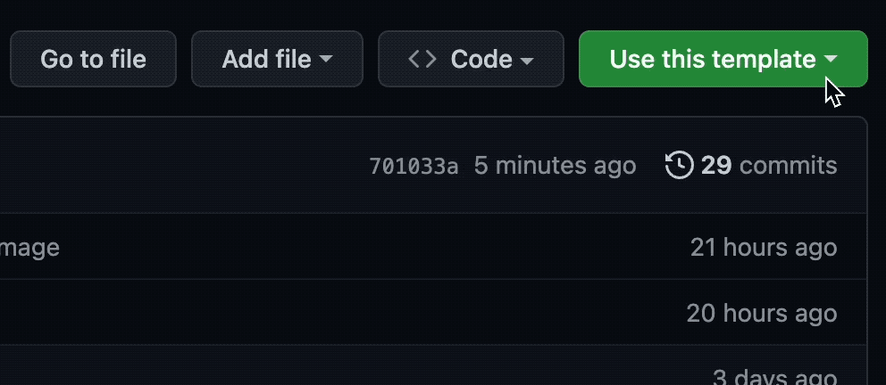

# Codespaces Meltano DIY Demo
## Welcome to Meltano! Run your first data pipeline within 5 minutes.
Even if you never touched [Meltano](https://github.com/meltano) before.
No install needed, just a GitHub account (and a few spare Codespaces minutes you get for free anyways).

Let's get started!

## Open codespaces (if it isn't already open)
Click "Open on Codespaces", to launch this project into a ready to use web VS-Code version with everything preloaded.



**Make sure to open up the README.md inside Codespaces as well.**

*Notes on codespaces:*

*- If you at any point get an error "The user denied permission to use Service Worker", then you need to enable third-party cookies. [It's a codespaces related problem](https://github.com/orgs/community/discussions/26316).*

*- In our experience, codespaces work best in Chrome or Firefox, not so well in Safari.*

*- Files in codespaces autosave! No need to save anything.*

# What you're building: let's run the final data pipeline first. #

There's a csv [customers.csv](data/customers.csv) with
- customer names, e-mail adresses and IPs
- you're going to extract this CSV and load it into an SQL-database.

Go ahead, just run

> `meltano run tap-csv hide-ips target-duckdb`

And that's it, you're done. Don't believe us? You can use a helper function to check the SQL-database:

> `./meltano_tut select_db`

Watch out for these things:
1. There are no ip addresses inside the database, right? Check [customers.csv](data/customers.csv), they were there.
2. That's because we added a "mapper" called "hide-ips" that is completely customizable and in this case hashes the IP addresses.
3. In the console output - Meltano told you at the beginning of the log ... "Schema 'raw' does not exist."
4. That is because Meltano has a lot of helper functions. It e.g. creates schemas and tables, should they not already exist.

Feel free to explore the project, or dive right into building it yourself!

**Let's go ahead and build it ourselves within 5 minutes**

# Step 1 - initialize a new meltano project

Inside the terminal (bottom window) run:

> `./meltano_tut init`

This runs a wrapped "meltano init", adding demo data for you to have fun with. This will *remove* what we preinstalled, so now we need to add a few things first.

# Step 2  - add your first extractor

Add your first extractor to get data from the CSV. Do so by running inside the terminal:

> `meltano add extractor tap-csv`

Then open up the file `meltano.yml`, copy the config below, and paste it below `pip_url`.

```yaml
    config:
      files:
      - entity: raw_customers
        path: data/customers.csv
        keys: [id]
```

Your complete config for tap-csv in `meltano.yml` should look like this:

```yaml
plugins:
  extractors:
  - name: tap-csv
    variant: meltanolabs
    pip_url: git+https://github.com/MeltanoLabs/tap-csv.git
    config:
      files:
      - entity: raw_customers
        path: data/customers.csv
        keys: [id]
```

# Step 3 - test run your tap

Let's test the tap by running:

> `meltano invoke tap-csv`

If everything works as expected, Meltano should extract the CSV and dump it as a "stream" onto standard output inside the terminal.

# Step 4 - add a loader

Next add a loader to load our data into a local duckdb:

> `meltano add loader target-duckdb`

Copy the configuration below and paste it below the `pip_url` for target-duckdb in the `meltano.yml` file.

```yaml
    config:
      filepath: output/my.duckdb
      default_target_schema: raw
```

The config in `meltano.yml` for target-duckdb should look like this:

```yaml
  loaders:
  - name: target-duckdb
    variant: jwills
    pip_url: target-duckdb~=0.4
    config:
      filepath: output/my.duckdb
      default_target_schema: raw
```

# Step 5 - run your EL pipeline

Now you can do your first complete EL run by calling `meltano run`!

> `meltano run tap-csv target-duckdb`

Perfect!

# Step 6 - view loaded data

To view your data you can use our little helper:

> `./meltano_tut select_db`

This will run a `SELECT * FROM public.raw_customers` on your duckdb instance and write the output to the terminal.

Great! You've completed your first extract and load run. 🥳

PS. If you liked what you saw, don't forget to [star us on GitHub](https://github.com/meltano/meltano) and consider joining our [Slack community](https://meltano.com/slack)!

# Next steps - level 2 to remove IP adresses
Next we want to start to remove the IP adresses, open up ["the level 2 instructions"](level2.md) for that!
